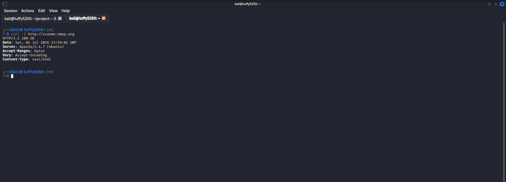
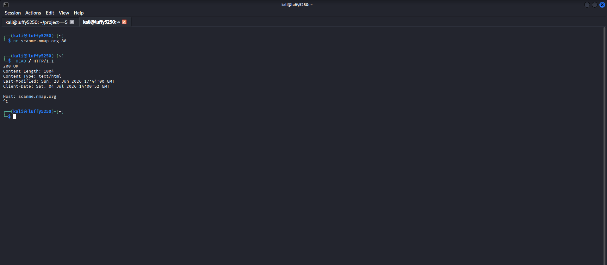
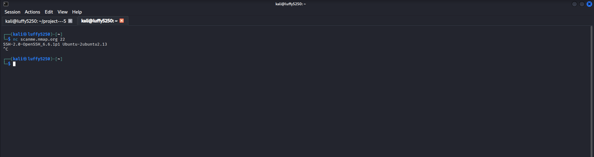
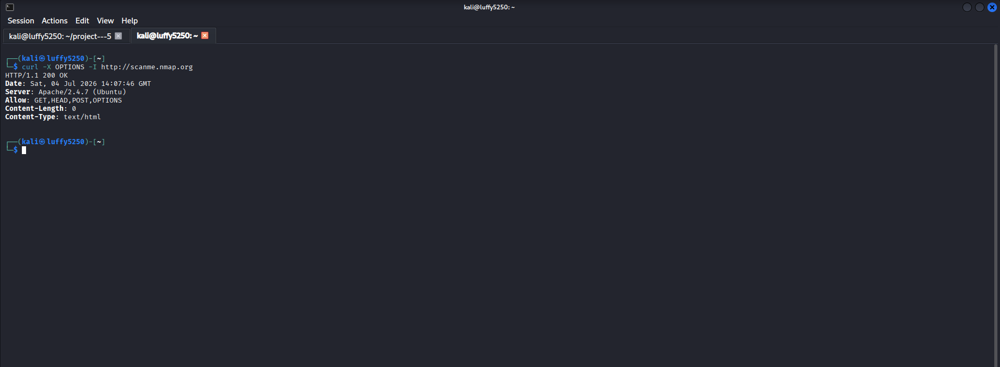

# Part 1 – Introduction to Enumeration & Banner Grabbing

## Objective

My goal is to learn about Enumeration and understand how banner grabbing helps me find out information about services running on a target system. I want to know what Enumeration is and how it works.

---

# What is Enumeration?

Enumeration is when I connect to a target system to get information from the services I found during network scanning. It is different from Footprinting and Scanning because Enumeration actually talks to a service to get information like:

- Hostname

- Operating System

- User Accounts

- Shared Resources

- Service Versions

- Domain Information

I only do Enumeration after I have found hosts and open ports on the target system.

---

# What is Banner Grabbing?

Banner Grabbing is a technique where I connect to a service and read the information it gives me when we connect. The banner might tell me:

- Service Name

- Software Version

- Operating System

- Hostname

- Protocol Information

This information helps people who work in security find problems with the system.

---

## 1. Grab an HTTP Banner

### Scenario

I want to get the HTTP response headers from a web server.

### Command

```bash

curl -I http://scanme.nmap.org

```

### Description

This command shows me the HTTP response headers, which might tell me what web server software is being used and other things.

### Screenshot



---

## 2. Grab a Banner Using Netcat

### Scenario

I want to connect to a web service and ask for the banner manually.

### Command

```bash

nc scanme.nmap.org 80

```

After I connect I type:

```text

HEAD / HTTP/1.1

Host: scanme.nmap.org

```

Then I press **Enter** after the `Host` line.

### Description

This shows me the HTTP response and the server banner.

### Screenshot



---

## 3. Grab an SSH Banner

### Scenario

I want to connect to an SSH service and read the service banner.

### Command

```bash

nc scanme.nmap.org 22

```

### Description

This shows me the SSH version banner that the server sends.

### Screenshot



---

## 4. Identify Supported HTTP Methods

### Scenario

I want to check which HTTP methods a web server supports.

### Command

```bash

curl -X OPTIONS -I http://scanme.nmap.org

```

### Description

This command asks the web server for the HTTP OPTIONS method to see which methods it allows.

### Screenshot



---

# Key Concepts Learned

- Enumeration

- Banner Grabbing

- HTTP Headers

- SSH Banner

- Service Identification

- HTTP Methods

---

# Conclusion

In this part, I learned:

- The difference between scanning and enumeration.
- What banner grabbing is.
- How to identify service information from banners.
- How HTTP and SSH services reveal useful information.
- Why banner grabbing is important before deeper enumeration.

