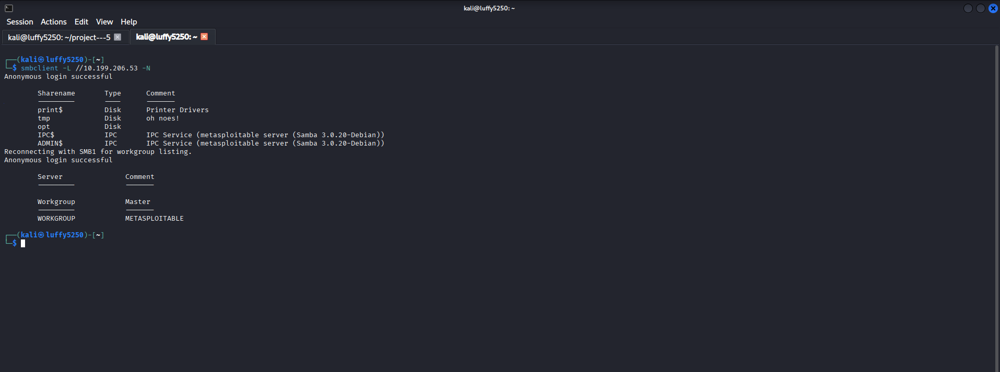
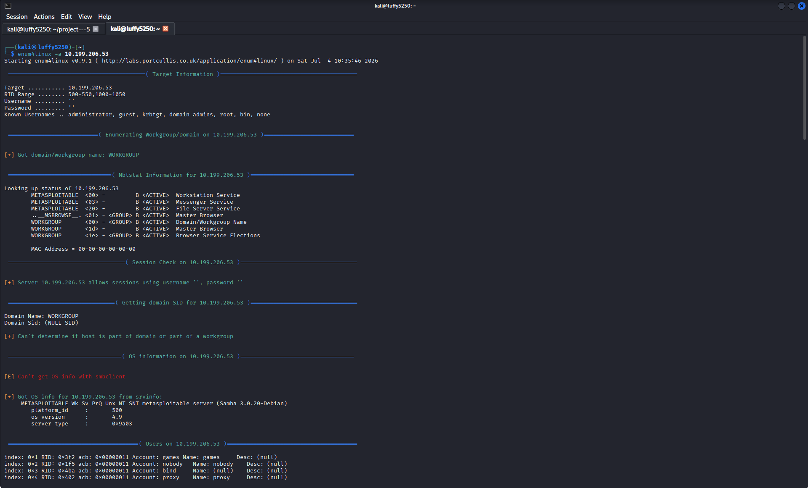
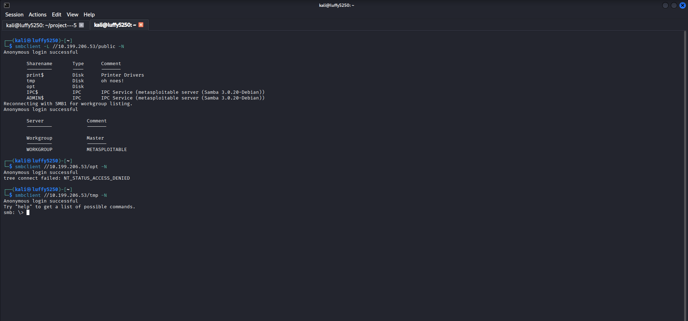
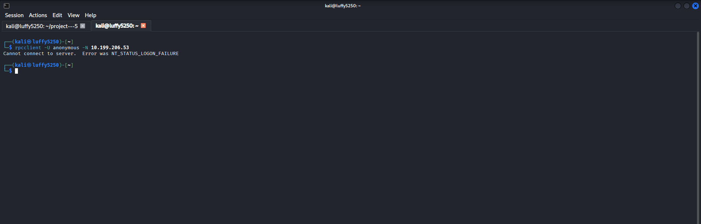

# Part 1 – Introduction to Enumeration & Banner Grabbing

## Objective

My goal is to learn about Enumeration and understand how banner grabbing helps me find out information about services running on a target system. I want to know what Enumeration is and how it works.

---

# What is Enumeration?

Enumeration is when I connect to a target system to get information from the services I found during network scanning. It is different from Footprinting and Scanning because Enumeration actually talks to a service to get information like:

- Hostname

- Operating System

- User Accounts

- Shared Resources

- Service Versions

- Domain Information

I only do Enumeration after I have found hosts and open ports on the target system.

---

# What is Banner Grabbing?

Banner Grabbing is a technique where I connect to a service and read the information it gives me when we connect. The banner might tell me:

- Service Name

- Software Version

- Operating System

- Hostname

- Protocol Information

This information helps people who work in security find problems with the system.

---

## 1. Grab an HTTP Banner

### Scenario

I want to get the HTTP response headers from a web server.

### Command

```bash

curl -I http://scanme.nmap.org

```

### Description

This command shows me the HTTP response headers, which might tell me what web server software is being used and other things.

### Screenshot


---

## 2. Grab a Banner Using Netcat

### Scenario

I want to connect to a web service and ask for the banner manually.

### Command

```bash

nc scanme.nmap.org 80

```

After I connect I type:

```text

HEAD / HTTP/1.1

Host: scanme.nmap.org

```

Then I press **Enter** after the `Host` line.

### Description

This shows me the HTTP response and the server banner.

### Screenshot


---

## 3. Grab an SSH Banner

### Scenario

I want to connect to an SSH service and read the service banner.

### Command

```bash

nc scanme.nmap.org 22

```

### Description

This shows me the SSH version banner that the server sends.

### Screenshot


---

## 4. Identify Supported HTTP Methods

### Scenario

I want to check which HTTP methods a web server supports.

### Command

```bash

curl -X OPTIONS -I http://scanme.nmap.org

```

### Description

This command asks the web server for the HTTP OPTIONS method to see which methods it allows.

### Screenshot


---

# Key Concepts Learned

- Enumeration

- Banner Grabbing

- HTTP Headers

- SSH Banner

- Service Identification

- HTTP Methods

---

# Conclusion

In this part, I learned:

- The difference between scanning and enumeration.
- What banner grabbing is.
- How to identify service information from banners.
- How HTTP and SSH services reveal useful information.
- Why banner grabbing is important before deeper enumeration.

---------------------------------------------------------------------------------------------------------------------------------------------------------------------------------------------------------------------


# Part 2 – SMB & NetBIOS Enumeration

## Objective

I want to learn how to find out about SMB and NetBIOS services on a network. This will help me discover what resources are being shared who the users are, what workgroups are there and what servers are on the network.

---

# What's SMB?

SMB is a way for computers to talk to each other on a network. It is used for:

- Sharing files

- Sharing printers

- Letting people manage computers from away

- Sharing other resources

SMB usually works on:

- TCP Port 445

- TCP Port 139 which is used for NetBIOS

---

# What is NetBIOS?

NetBIOS helps computers on a network find each other and talk to each other. If I look closely I can find out:

- What the computer is named

- What workgroup it belongs to

- What resources are being shared

- Who is logged in

- What kind of operating system it's using

---

## 1. Enume rate SMB Shares

### Scenario

I want to see what SMB shares are available on a computer.

### Command

```bash

smbclient -L <target IP> -N

```

### Description

This command shows me what shared folders are available on the computer. It does this without needing a password.

Replace the IP address with the one I am looking at.

### Screenshot



---

## 2. Perform SMB Enumeration

### Scenario

I want to collect much information as I can about SMB on a computer.

### Command

```bash

enum4linux -a <target IP>

```

### Description

This command tells me about SMB shares, users, groups and NetBIOS. It gives me a lot of information about the computer.

### Screenshot



> **Note:** If I do not have `enum4linux` installed:

```bash

sudo apt install enum4linux

```

---

## 3. Connect to a Shared Folder

### Scenario

I found a shared folder. I want to access it.

### Command

```bash

smbclient //<target IP>/public -N

```

### Description

This command lets me connect to the shared folder without needing a password if that is allowed.

### Screenshot



---

## 4. Enumerate RPC Information

### Scenario

I want to find out more about a computer using the Remote Procedure Call service.

### Command

```bash

rpcclient -U "" -N text<target IP>

```

After I connect:

```text

srvinfo

```

### Description

This command gives me information about the server using the RPC service.

### Screenshot



---

# Key Concepts Learned

- SMB Enumeration

- NetBIOS Enumeration

- Finding Shared Folders

- Accessing things, without a password

- RPC Enumeration

---

# conclusion

In this part I learned:

- How to use SMB enumeration to find shared resources.

- How NetBIOS helps computers talk to each other.

- How to list what SMB shares are available.

- How to get into shared folders.

- How to use RPC to find out about servers.
